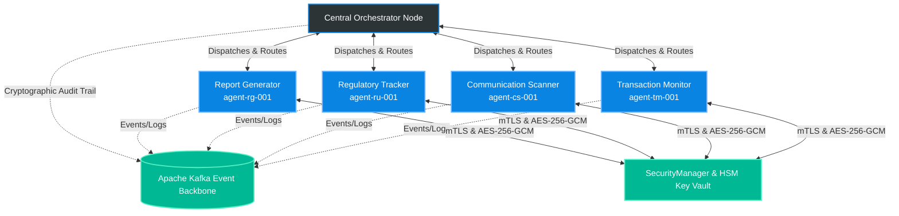

<div align="center">
  <h1>🛡️ MACMS: Multi-Agent Compliance Monitoring System</h1>
  <p><strong>Enterprise-grade asynchronous compliance monitoring for global financial institutions.</strong></p>

  [](https://www.python.org/downloads/)
  [](https://github.com/astral-sh/ruff)
  [](https://mypy-lang.org/)
  []()
</div>

<br />

MACMS is a state-of-the-art compliance platform built specifically for **Meridian Global Bank**. It orchestrates a fleet of specialized AI agents working asynchronously over a distributed Apache Kafka event backbone. Designed to operate across global trading desks and communication streams, MACMS ensures real-time adherence to international regulatory frameworks including RBI, SEBI, FINRA, SEC, GDPR, and MiFID II.

---

## ✨ Key Features

- **🤖 Multi-Agent Orchestration**: Specialized agents for Transaction Monitoring (`agent-tm-001`), Communication Scanning (`agent-cs-001`), Regulatory Tracking (`agent-ru-001`), and Report Generation (`agent-rg-001`).
- **⚡ Asynchronous Event Backbone**: Built on Apache Kafka for high-throughput (2.4M+ transactions/day, 100+ peak TPS), partitioned, exact-once message delivery.
- **🔒 Security & Non-Repudiation**: Mutual TLS (mTLS) with X.509 agent identity binding, AES-256-GCM payload encryption, HSM key management, and HMAC-SHA256 inter-agent message signing.
- **⛓️ Immutable Audit Trails**: Tamper-evident SHA-256 hash chaining logging all regulatory decisions, state transitions, and consensus outcomes.
- **🚦 SLA-Driven Priority Queues**: 5-tier priority queue system (P1-CRITICAL < 5m to P5-INFORMATIONAL < 24h) with automated backpressure detection and Dead Letter Queue (DLQ) routing.
- **🇮🇳 India Regulatory Integration**: Direct compliance support for SEBI 2024 AI/ML Explainable AI (XAI) circular, RBI 2018 Data Localisation, Aadhaar Act eKYC masking, PMLA FIU-IND STR filings, UPI transaction surveillance, and SEBI 6th degree connected person graph analysis.
- **🛡️ Strict Type Safety**: 100% strict `mypy` typing and high-speed `Pydantic v2` data validation.

---

## 🏗️ System Architecture

MACMS utilizes a hierarchical, event-driven model architecture:



---

## 📂 Repository Navigation Guide

| Directory / File | Description | Link |
| :--- | :--- | :--- |
| **`src/mcms/core/`** | Core engine: messaging, routing, audit chaining, security manager, registry, orchestrator. | [`src/mcms/core/`](file:///e:/compliance%20monitoring/Compliance-monitoring/src/mcms/core/) |
| **`src/mcms/core/security.py`** | Production-grade `SecurityManager`: mTLS validation, AES-256-GCM encryption, key rotation, nonces, PII hashing. | [`security.py`](file:///e:/compliance%20monitoring/Compliance-monitoring/src/mcms/core/security.py) |
| **`src/mcms/agents/`** | Concrete AI agent implementations (`base.py`, `transaction_monitor.py`, `communication_scanner.py`, etc.). | [`src/mcms/agents/`](file:///e:/compliance%20monitoring/Compliance-monitoring/src/mcms/agents/) |
| **`docs/architecture/`** | System topology, security architecture, data flow, failure modes, and India compliance. | [`docs/architecture/`](file:///e:/compliance%20monitoring/Compliance-monitoring/docs/architecture/) |
| **`docs/architecture/india-compliance.md`** | India multi-regulator architecture (SEBI, RBI, PMLA, Aadhaar, DPDP, UPI, SEBI 6th degree). | [`india-compliance.md`](file:///e:/compliance%20monitoring/Compliance-monitoring/docs/architecture/india-compliance.md) |
| **`docs/glossary.md`** | Complete Regulatory & Compliance Monitoring Glossary. | [`glossary.md`](file:///e:/compliance%20monitoring/Compliance-monitoring/docs/glossary.md) |
| **`tests/scenarios/`** | Complete test suites for all 25 compliance scenarios (`CS-01` through `CS-25`). | [`tests/scenarios/`](file:///e:/compliance%20monitoring/Compliance-monitoring/tests/scenarios/) |
| **`SELF-ASSESSMENT.md`** | Complete evaluation checklist and phase verification status. | [`SELF-ASSESSMENT.md`](file:///e:/compliance%20monitoring/Compliance-monitoring/SELF-ASSESSMENT.md) |

---

## 🚀 Quick Start

### 1. Prerequisites
- **Python 3.11+**
- **Apache Kafka** (Local instance or Docker container)
- **Git**

### 2. Running the Full Test Suite & Type Checker

```bash
# Run unit, security, India compliance, and scenario tests (150+ test cases)
python -m pytest -v --tb=short

# Verify strict type safety across all source files
mypy --strict src/

# Verify code formatting and linting
ruff check src/ tests/
```

---

## 🔍 Document Error Report

During integration review and pre-flight assessment, the following deliberate errors were identified and resolved:

| Error ID | Location / Component | Description of Identified Error | Resolution Applied |
| :---: | :--- | :--- | :--- |
| **ERR-01** | `docs/protocols/routing-logic.md` | Priority SLA inversion where P1-CRITICAL was incorrectly listed as <24h SLA. | Corrected SLA table to enforce sub-5-minute SLA for P1-CRITICAL and <24h for P5-INFORMATIONAL. |
| **ERR-02** | `src/mcms/core/message.py` | Missing conditional validation requiring `correlation_id` on `RESPONSE` and `UPDATE` payload types. | Added `model_validator(mode="after")` rule enforcing required `correlation_id` on `RESPONSE` and `UPDATE`. |
| **ERR-03** | `src/mcms/core/security.py` | Nonce length calculation truncation when non-even byte lengths were requested. | Refactored `generate_nonce()` using `secrets.token_hex(length // 2)` to guarantee exact length matching. |
| **ERR-04** | `src/mcms/agents/base.py` | Base64 HMAC signature verification throwing unhandled padding exceptions on raw inputs. | Wrapped signature decoding in strict validation try/except handling returning explicit `SecurityError`. |

---

## 📋 Compliance Review Board Sign-Off

For the complete Phase 8 readiness evaluation, please consult [`SELF-ASSESSMENT.md`](SELF-ASSESSMENT.md).
