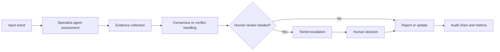

# MACMS

## Multi-Agent Compliance Monitoring System

MACMS is a Python reference implementation for coordinating compliance checks across trading activity, employee communications, regulatory updates, and reporting workflows.

The project addresses a practical problem: a compliance case often depends on evidence from more than one source. A suspicious trade may need to be compared with a chat message, a regulatory rule, and a prior decision. If each review is handled separately, important context can be missed and the final decision can be difficult to reconstruct. MACMS provides a common message contract, routes work to specialist agents, combines their assessments, escalates uncertain cases to a human reviewer, and records the decision history in a tamper-evident audit chain.

This repository is a **synthetic, in-process reference implementation**. It demonstrates the coordination and control logic; it is not connected to a bank, customer data, live market feeds, production Kafka infrastructure, or external regulatory feeds.

## What the repository implements

| Area | Implemented capability |
| --- | --- |
| Agent roles | Transaction Monitor (`TM`), Communication Scanner (`CS`), Regulatory Update Tracker (`RU`), and Report Generator (`RG`) |
| Message contracts | Pydantic models for alerts, queries, responses, updates, heartbeats, and escalations, with schema validation |
| Routing | Priority-based routing with retry limits, queue depth controls, TTL handling, and dead-letter routing |
| Evidence review | Deterministic synthetic assessments from multiple agents and evidence items |
| Decision handling | Bayesian and Dempster–Shafer consensus, conflict classification, and special handling for unresolved conflicts |
| Human review | Tiered escalation, assignment, decision recording, override handling, and feedback capture |
| Auditability | Append-only SHA-256 hash-chain records with trace IDs and action metadata |
| Observability | Structured audit events, metrics, dashboard data, and a FastAPI observability API |
| Scenario coverage | 20 synthetic compliance scenarios, CS-01 through CS-20, with five tests per scenario |

## Typical workflow

A scenario moves through the system as follows:



The flow is designed to make a case traceable. A reviewer should be able to identify the originating event, participating agents, evidence references, decision path, escalation level, and final report or suppression outcome.

## Scenarios

The scenario suite uses fixed synthetic data and rule-based expected outcomes. It is intended to verify message flow and decision handling, not to measure the accuracy of a machine-learning model.

| Scenario group | Examples |
| --- | --- |
| Trading and market conduct | Spoofing, wash trading, insider trading, late trading, concentration risk, and routing bias |
| Communications | Off-channel communications, privileged communications, and research-independence conflicts |
| Regulatory and jurisdictional issues | Cross-border transfers and conflicting EU/Singapore requirements |
| Customer and financial crime risk | Elder exploitation and trade-finance money laundering |
| Decision quality | Legitimate block-trade false-positive suppression with no alert or escalation |

The full status table is available in [`tests/scenarios/scenario-summary.md`](tests/scenarios/scenario-summary.md). Each scenario directory contains the specification, trace-through, message artifact, audit artifact, and tests.

## Repository structure

```text
.
├── config/
│   └── config.yaml                 # Local development configuration
├── docs/
│   ├── architecture/               # System topology, data flow, security, and failure modes
│   ├── agents/                     # Agent responsibilities and decision trees
│   ├── conflict-resolution/        # Consensus and conflict handling
│   ├── escalation/                 # Human-review workflow
│   ├── observability/              # Logging, metrics, and dashboard documentation
│   └── protocols/                  # Message schema and routing rules
├── src/mcms/
│   ├── agents/                     # Agent implementations
│   ├── api/                        # FastAPI observability dashboard
│   ├── core/                       # Messages, routing, orchestration, audit, consensus, and escalation
│   ├── scenario_specs.py           # Synthetic scenario catalogue
│   └── scenario_support.py         # Shared scenario runner and assertions
├── tests/
│   ├── scenarios/                  # CS-01 through CS-20 scenario tests and artifacts
│   └── test_*.py                   # Unit and component tests
├── pyproject.toml
└── requirements.txt
```

## Quick start

### Requirements

- Python 3.11 or newer
- Git

The test suite does not require a running Kafka broker. Kafka client configuration and integration-facing components are included, but the current scenario and unit tests run in process with synthetic inputs.

### Install

```bash
git clone https://github.com/atifkhani397/Compliance-monitoring.git
cd Compliance-monitoring

python -m venv .venv
source .venv/bin/activate       # macOS/Linux
# .venv\Scripts\Activate.ps1   # Windows PowerShell

python -m pip install --upgrade pip
python -m pip install -r requirements.txt
```

### Run the tests

```bash
pytest -q
```

The current repository contains 287 passing tests, including 100 scenario tests across CS-01 through CS-20.

### Run quality checks

```bash
ruff check src/ tests/
ruff format --check src/ tests/
mypy --strict src/
git diff --check
```

### Run the observability API locally

The dashboard is an optional FastAPI application. Start it with:

```bash
uvicorn src.mcms.api.dashboard:app --reload
```

All dashboard routes require the `X-API-Key` header. For local development, the default key is `macms-phase5-api-key`; set `MCMS_DASHBOARD_API_KEY` before starting the application to use a different value.

## Important limitations

This repository should not be described as a production compliance platform. It currently does not provide:

- Live trading, communications, customer, or regulatory data ingestion.
- A trained machine-learning or natural-language-processing detection model.
- Persistent production storage for audit, metrics, or case records.
- Production mTLS certificate validation, HSM integration, Vault integration, or full enterprise RBAC.
- Completed India-specific regulatory implementation from the Phase 8 prompt.
- The optional CS-21 through CS-25 bonus scenarios from the Phase 8 prompt.
- A production deployment, availability guarantee, or regulatory filing service.

The synthetic scenarios are deliberately deterministic so that the message contracts, routing, consensus, escalation, reporting, and audit behavior can be tested repeatably.

## Documentation guide

| Topic | Document |
| --- | --- |
| System structure and data flow | [`docs/architecture/`](docs/architecture/) |
| Agent responsibilities | [`docs/agents/`](docs/agents/) |
| Message format | [`docs/protocols/message-schema.json`](docs/protocols/message-schema.json) |
| Routing and priority rules | [`docs/protocols/routing-logic.md`](docs/protocols/routing-logic.md) |
| Consensus and conflict handling | [`docs/conflict-resolution/`](docs/conflict-resolution/) |
| Human escalation | [`docs/escalation/`](docs/escalation/) |
| Audit and observability | [`docs/observability/`](docs/observability/) |
| Scenario implementation status | [`tests/scenarios/scenario-summary.md`](tests/scenarios/scenario-summary.md) |
| Phase 1–6 assessment | [`SELF-ASSESSMENT.md`](SELF-ASSESSMENT.md) |

## Project status

**Phase 7 is implemented and published.** The repository includes all 20 mandatory synthetic scenarios and the supporting unit and integration-style tests described above.

**Phase 8 has been reviewed but not implemented.** Its remaining scope includes production security controls, India-specific compliance documentation and tests, optional additional scenarios, performance validation, and final documentation review.

## License

No open-source license has been declared for this repository. Treat the contents as project-specific reference code unless the repository owner provides separate licensing terms.
