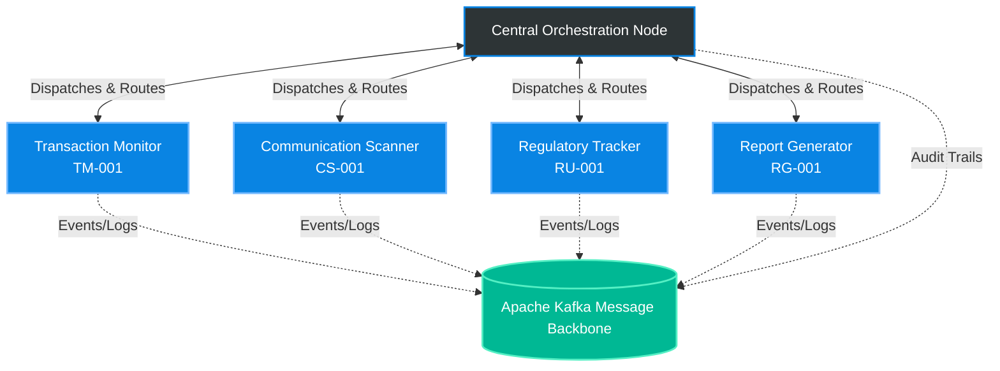

<div align="center">
  <h1>🛡️ MACMS: Multi-Agent Compliance Monitoring System</h1>
  <p><strong>Enterprise-grade asynchronous compliance monitoring for global financial institutions.</strong></p>

  [](https://www.python.org/downloads/)
  [](https://github.com/astral-sh/ruff)
  [](https://mypy-lang.org/)
  []()
  []()
</div>

<br />

MACMS is a state-of-the-art compliance platform built specifically for **Meridian Global Bank**. It orchestrates a fleet of specialized AI agents working asynchronously over a distributed Apache Kafka event backbone. Designed to operate across global trading desks and communication streams, MACMS ensures real-time adherence to international regulatory frameworks including RBI, SEBI, FINRA, SEC, GDPR, and MiFID II.

---

## ✨ Key Features

- **🤖 Multi-Agent Orchestration**: Specialized agents for Transaction Monitoring, Communication Scanning, Regulatory Tracking, and Report Generation.
- **⚡ Asynchronous Event Backbone**: Built on Apache Kafka for high-throughput, partitioned, exact-once message delivery.
- **🔒 Cryptographic Non-Repudiation**: Every inter-agent message is secured using HMAC-SHA256 signatures to ensure origin authenticity.
- **⛓️ Immutable Audit Trails**: Tamper-evident SHA-256 hash chaining logs all regulatory decisions and system events.
- **🚦 SLA-Driven Routing**: Five-tier priority queue system (P1-CRITICAL to P5-INFORMATIONAL) guaranteeing sub-5-minute SLAs for critical market abuse alerts.
- **🛡️ Strict Type Safety**: 100% strict `mypy` typing and high-speed `Pydantic v2` data validation.

---

## 🏗️ System Architecture

MACMS utilizes a hierarchical, event-driven C4 model architecture:



---

## 📂 Repository Structure

Our documentation and source code are modularized for clarity:

```text
Compliance-monitoring/
├── config/                # System configuration files (YAML/JSON)
├── docs/                  # Comprehensive system documentation
│   ├── architecture/      # C4 models, topology, data flow, security
│   ├── protocols/         # Kafka schemas and routing logic
│   ├── conflict-resolution/# Consensus algorithms for agent disputes
│   ├── decision-trees/    # Agent execution capability matrices
│   ├── escalation/        # Human-in-the-loop escalation frameworks
│   └── observability/     # Audit, metrics, and structured logging
├── src/
│   └── mcms/              # Core source code package
│       ├── agents/        # Concrete agent implementations
│       └── core/          # Orchestrator, registry, and crypto utilities
└── tests/                 # Complete Pytest suite (unit & async tests)
```

---

## 🚀 Quick Start

### 1. Prerequisites
- **Python 3.11+**
- **Apache Kafka** (Local instance or Docker container)
- **Git**

### 2. Installation

Clone the repository and set up your virtual environment:

```bash
git clone https://github.com/atifkhani397/Compliance-monitoring.git
cd Compliance-monitoring

# Create and activate virtual environment
python -m venv .venv

# Windows
.\.venv\Scripts\Activate.ps1
# macOS/Linux
source .venv/bin/activate
```

Install the required dependencies:

```bash
pip install -r requirements.txt
```

### 3. Configuration

Create a `.env` file in the root directory (refer to `.env.example` if needed):

```env
MACMS_ENV=development
MACMS_LOG_LEVEL=INFO
KAFKA_BOOTSTRAP_SERVERS=localhost:9092
AUDIT_CHAIN_SECRET_KEY=meridian-global-audit-secret-key-2026
```

### 4. Running the Test Suite

MACMS maintains a 100% strict coverage standard. Verify your installation by running the test suite and type checker:

```bash
# Run unit and async tests
python -m pytest -v --tb=short

# Verify strict type safety
mypy --strict src/
```

---

## 🛠️ Technology Stack

| Component | Technology | Justification |
| :--- | :--- | :--- |
| **Language** | Python 3.11+ | High performance async event loops, rich data science ecosystem, strict typing. |
| **Validation** | Pydantic v2 | Rust-accelerated validation, strict schema enforcement, and JSON parsing. |
| **Message Broker** | Apache Kafka | Distributed log architecture, high throughput, exact-once semantics. |
| **Logging** | `structlog` | Context-aware structured JSON log rendering with zero-overhead. |
| **Cryptography** | `cryptography` | OpenSSL-backed primitives for HMAC-SHA256 signing and hash chaining. |
| **Testing** | `pytest` + `pytest-asyncio` | Production-standard async testing and strict coverage reporting. |

---

## 📋 Compliance & Auditing

Phase 2 establishes the core agent specifications and infrastructure adhering strictly to Meridian Global Bank's internal controls.
For the full Phase 1 and 2 readiness evaluation, please consult the [`SELF-ASSESSMENT.md`](SELF-ASSESSMENT.md).
