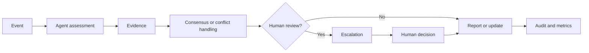

# MACMS

## Multi-Agent Compliance Monitoring System

MACMS is a Python reference implementation for coordinating compliance reviews across trading activity, employee communications, regulatory updates, and reporting.

## The problem

Compliance cases rarely come from one source. A suspicious trade may need to be reviewed alongside a chat message, a regulatory rule, and earlier case evidence. When these checks are performed in separate systems, context can be lost and the final decision is harder to explain or audit.

MACMS provides one workflow for this process. It sends work to specialist agents, combines their findings, routes uncertain cases to human reviewers, and records the case history in a tamper-evident audit chain.

## What is implemented

| Component | Current implementation |
| --- | --- |
| Specialist agents | Transaction Monitor, Communication Scanner, Regulatory Update Tracker, and Report Generator |
| Message protocol | Pydantic message models and a generated JSON Schema for alerts, queries, responses, updates, heartbeats, and escalations |
| Routing | Priority queues, retry limits, TTL handling, queue-depth controls, and dead-letter routing |
| Decision handling | Bayesian and Dempster–Shafer consensus, conflict classification, and unresolved-conflict handling |
| Human review | Tiered escalation, reviewer assignment, decisions, overrides, and feedback records |
| Audit | Append-only SHA-256 hash chains with trace IDs and action metadata |
| Observability | Structured audit events, metrics, and a FastAPI dashboard API |
| Scenarios | 20 deterministic synthetic scenarios, CS-01 through CS-20 |

## Processing flow



Each scenario records the event, participating agents, evidence references, decision path, escalation level, and final outcome.

## Current scope

The repository uses fixed synthetic inputs and deterministic rules. The tests verify message validation, routing, agent coordination, consensus, escalation, reporting, and audit behavior. They do not measure the accuracy of a machine-learning model.

The current tests run in process. Kafka client and configuration code are included, but a running Kafka broker is not required for the test suite.

## Scenarios

The 20 scenarios cover trading and market conduct, communications, regulatory conflicts, customer risk, financial crime, and false-positive suppression.

CS-18 verifies that a legitimate $450M block trade is suppressed after review, with reduced confidence and no alert or escalation. CS-19 verifies special handling for conflicting EU and Singapore requirements. CS-20 verifies coordination among all four specialist agents for a trade-finance money-laundering case.

See the complete scenario table in [`tests/scenarios/scenario-summary.md`](tests/scenarios/scenario-summary.md). Each scenario directory contains its specification, trace-through, message artifact, audit artifact, and tests.

## Quick start

### Requirements

- Python 3.11 or newer
- Git

### Install

```bash
git clone https://github.com/atifkhani397/Compliance-monitoring.git
cd Compliance-monitoring

python -m venv .venv
source .venv/bin/activate       # macOS/Linux
# .venv\Scripts\Activate.ps1   # Windows PowerShell

python -m pip install --upgrade pip
python -m pip install -r requirements.txt
```

### Run tests

```bash
pytest -q
```

The current repository has 287 passing tests, including 100 scenario tests across CS-01 through CS-20.

### Run checks

```bash
ruff check src/ tests/
ruff format --check src/ tests/
mypy --strict src/
git diff --check
```

### Start the dashboard API

The dashboard is optional. Set a local development API key and start FastAPI with:

```bash
export MCMS_DASHBOARD_API_KEY=dev-only-key
uvicorn src.mcms.api.dashboard:app --reload
```

Send the same value in the `X-API-Key` header when calling dashboard endpoints.

## Repository layout

```text
.
├── config/config.yaml             # Local configuration
├── docs/
│   ├── architecture/              # Topology, data flow, security, and failure modes
│   ├── agents/                    # Agent responsibilities and decision trees
│   ├── conflict-resolution/       # Consensus and conflict handling
│   ├── escalation/                # Human-review workflow
│   ├── observability/             # Logging, metrics, and dashboard documentation
│   └── protocols/                 # Message schema and routing rules
├── src/mcms/
│   ├── agents/                    # Agent implementations
│   ├── api/                       # FastAPI dashboard API
│   ├── core/                      # Core message, routing, audit, and review services
│   ├── scenario_specs.py          # Synthetic scenario definitions
│   └── scenario_support.py        # Shared scenario runner and assertions
├── tests/
│   ├── scenarios/                 # CS-01 through CS-20
│   └── test_*.py                  # Unit and component tests
├── pyproject.toml
└── requirements.txt
```

## Documentation

| Topic | Link |
| --- | --- |
| Architecture and data flow | [`docs/architecture/`](docs/architecture/) |
| Agent responsibilities | [`docs/agents/`](docs/agents/) |
| Message schema | [`docs/protocols/message-schema.json`](docs/protocols/message-schema.json) |
| Routing rules | [`docs/protocols/routing-logic.md`](docs/protocols/routing-logic.md) |
| Consensus and conflict handling | [`docs/conflict-resolution/`](docs/conflict-resolution/) |
| Human escalation | [`docs/escalation/`](docs/escalation/) |
| Audit and observability | [`docs/observability/`](docs/observability/) |
| Scenario status | [`tests/scenarios/scenario-summary.md`](tests/scenarios/scenario-summary.md) |
| Existing self-assessment | [`SELF-ASSESSMENT.md`](SELF-ASSESSMENT.md) |

## Limitations

This is not a production compliance platform. It does not currently include live data feeds, customer data, trained ML/NLP detection, production persistence, production mTLS certificate validation, HSM or Vault integration, a complete enterprise RBAC implementation, external regulatory-feed parsing, or regulatory filing submission.

The India-specific work, performance validation, and optional CS-21 through CS-25 scenarios described in the Phase 8 prompt are not implemented.

Do not use the sample configuration secrets or synthetic artifacts in a production environment.

## Status

**Phase 7 is complete.** All 20 mandatory synthetic scenarios and their supporting tests are implemented.

**Phase 8 has been reviewed but is not implemented.** It is the remaining work for production security, India-specific compliance, additional scenarios, performance validation, and final documentation review.

## License

No open-source license has been declared for this repository. Treat the code and documentation as project-specific reference material unless the repository owner provides separate licensing terms.
