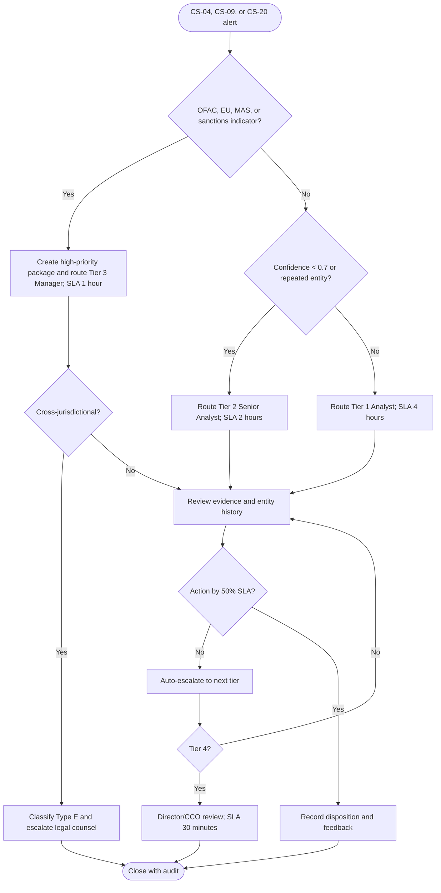

# AML and Sanctions Escalation Decision Tree

The package must preserve sanction-list references, jurisdictions, affected entities, evidence custody, regulatory context, and the recommended action. External sanctions feeds and paging are explicitly outside Phase 4.
