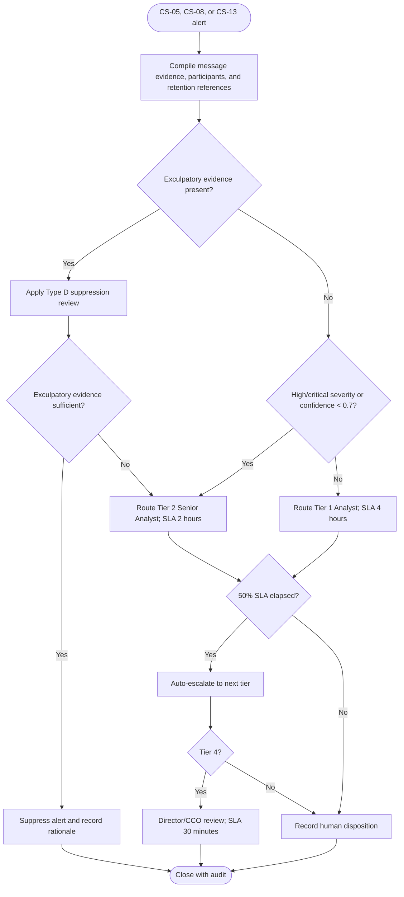

# Communications Violation Escalation Decision Tree

The decision-support package must identify source communications, participants, evidence references, historical context, and any dissenting agent assessments. Human overrides remain subject to the authority matrix and cooling period.
