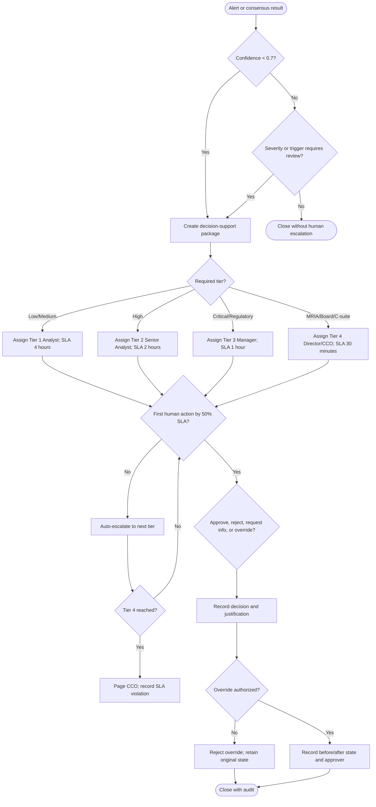

# General Escalation Decision Tree

The escalation service records every transition in memory and in the append-only audit chain. A missed SLA is actionable after 50 percent of the tier SLA has elapsed. Tier 3 and Tier 4 use the on-call route after hours; Tier 4 goes directly to the CCO.
