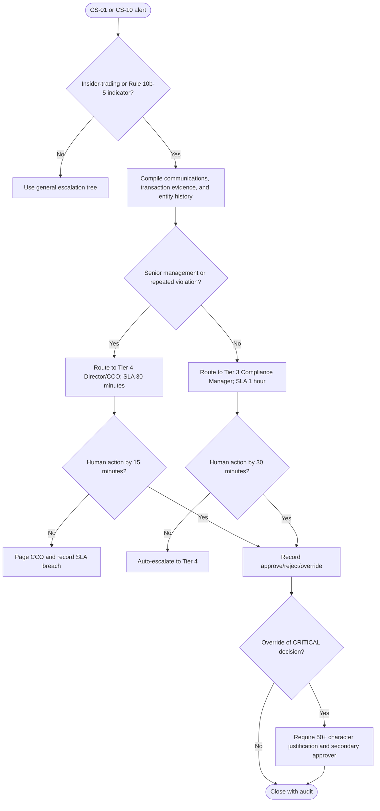

# Insider Trading Escalation Decision Tree

The decision-support package must preserve trading timestamps, communication evidence, applicable regulations, historical violations, and all agent disagreement details. No external notification is implemented in Phase 4.
