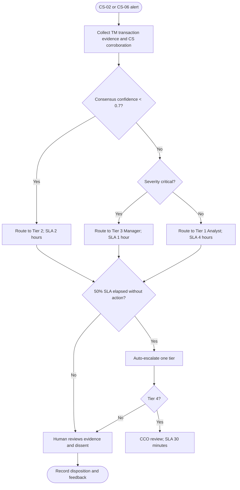

# Market Manipulation Escalation Decision Tree

The package must include the transaction pattern, impacted instruments and accounts, cross-agent evidence, confidence, and recommended action. If a regulatory conflict is found during review, the case follows the regulatory-conflict tree and is escalated to legal counsel.
