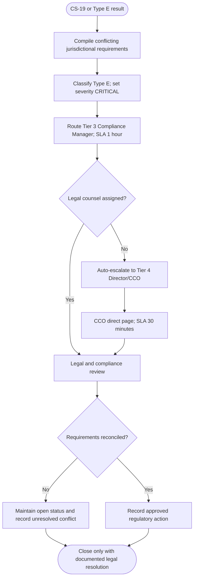

# Regulatory Conflict Escalation Decision Tree

Type E cannot be suppressed by numerical agreement between agents. The package must retain each jurisdiction, requirement, evidence source, applicable enforcement context, and the reason legal counsel was engaged.
